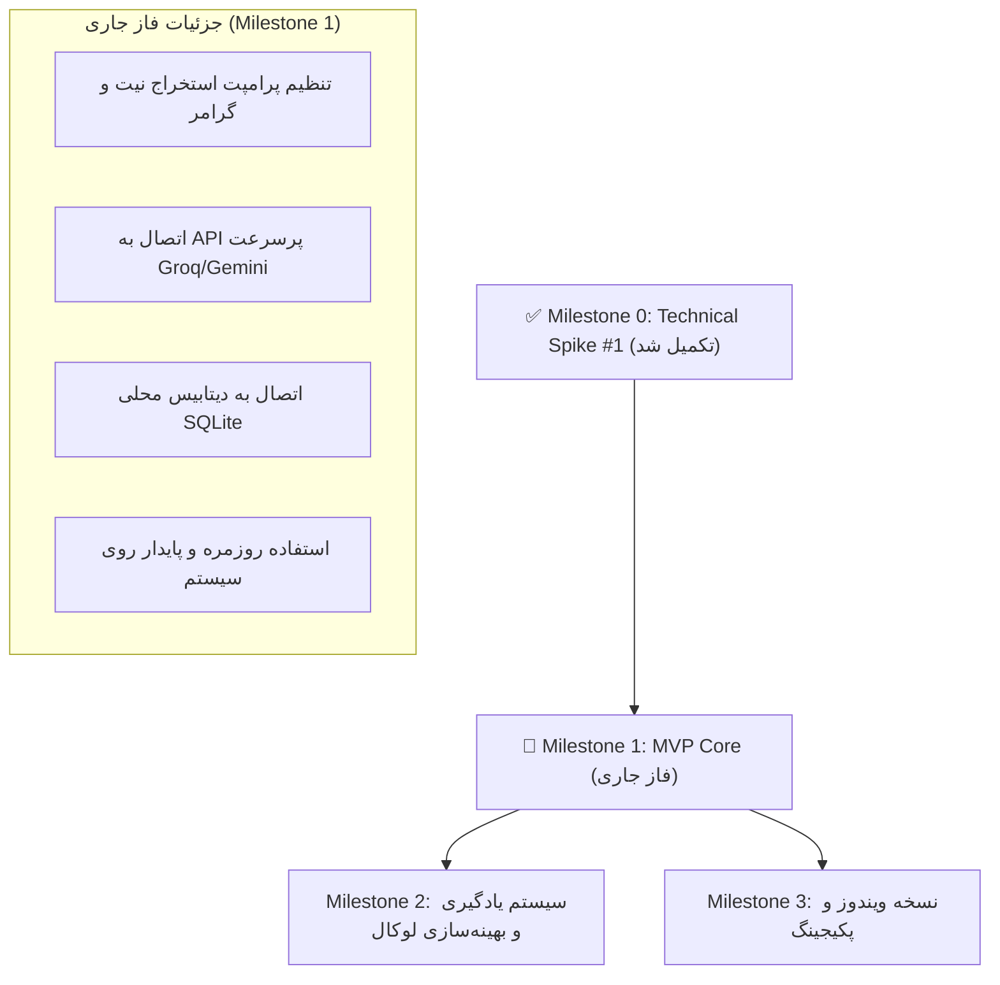

# System-wide English Writing & Learning Companion

## Business, Product & Architecture Document — v2.2 (Spike Validated)

**Document Status:** Architecture Finalized — Spike #1 Verified  
**Version:** 2.2  
**Validation Date:** September 18, 2026  
**Primary Platform:** Ubuntu Linux 24.04 (Wayland / GNOME 46) — **VALIDATED**  
**Secondary Platform:** Windows 10/11 (Architecture Ready)  
**Product Type:** System-wide desktop writing & expression companion  

---

# ۱. نتایج رسمی اسپایک فنی شماره ۱ (Technical Spike #1 Results)

در تاریخ ۱۸ سپتامبر ۲۰۲۶، آزمون زنده‌ی اسپایک شماره ۱ روی محیط واقعی کاربر با مشخصات `Ubuntu 24.04 / GNOME 46 / Wayland` انجام شد و نتایج زیر به ثبت رسید:

| مؤلفه ارزیابی | روش پیاده‌سازی تست‌شده | نتیجه تست زنده | وضعیت ریسک |
| :--- | :--- | :--- | :--- |
| **Selection Capture** | فراخوانی `wl-paste --primary` از طریق ساب‌پراسس امن | متن هایلایت‌شده در تمام برنامه‌ها بلافاصله خوانده شد | **حل‌شده (De-risked)** |
| **Global Shortcut** | رجیستر کلید در گنوم (`<Primary><Alt>g`) | فعال‌سازی پنجره در کسری از ثانیه بدون هیچ تاخیر محسوس | **حل‌شده (De-risked)** |
| **HUD Rendering** | پنجره مستقل GTK4 با تم Dark و استایل مدرن | نمایش آنی بدون باگ فوکوس، پشتیبانی روان از متن فارسی/انگلیسی | **حل‌شده (De-risked)** |
| **Keyboard Control** | کنترل کیبورد (`Enter` برای تایید، `Esc` برای لغو) | واکنش‌پذیری ۱۰۰٪ بدون نیاز به ماوس | **حل‌شده (De-risked)** |
| **Clipboard Update** | نوشتن در کلیپ‌بورد اصلی و primary با `wl-copy` | متن خروجی بلافاصله با `Ctrl + V` قابل پیست است | **حل‌شده (De-risked)** |

> **نتیجه اسپایک:** بزرگترین ریسک فرضی پروژه (تعامل با سیستم‌عامل در لینوکس مدرن Wayland) با موفقیت کامل و بدون نیاز به دسترسی Root رفع شد. مسیر برای پیاده‌سازی کامل MVP هموار است.

---

# ۲. تعریف بنیادین و هویت محصول (Product Definition)

این ابزار یک **Grammar Checker سنتی نیست**.  
محصول یک لایه‌ی سبک، نامرئی و سراسری (System-wide) روی سیستم‌عامل است که به کاربر اجازه می‌دهد حتی با:
* انگلیسی دست‌وپا شکسته
* انگلیسی با گرامر و ساختار ذهنی فارسی (Persian-to-English cognitive transfer)
* ترکیب کلمات فارسی در میان متن انگلیسی (مثلاً `Can we [سازگار کنیم] this?`)
* واژگان ناقص یا phrasing غیرطبیعی

منظور خود را بنویسد و سیستم:
1. منظور فنی و واقعی کاربر را به‌صورت محافظه‌کارانه (Conservative) استخراج کند.
2. آن را به انگلیسی طبیعی، حرفه‌ای و روان تبدیل کند.
3. **برداشت خود از منظور کاربر را به زبان فارسی نمایش دهد (Semantic Checkpoint)** تا از بروز خطای حیاتی *Semantic Drift* در پرامپت‌ها و کدها جلوگیری شود.
4. تفاوت‌های کلیدی را در ۱ خط آموزش دهد (Micro-Pedagogy).
5. با زدن یک کلید (`Enter`)، متن را در کلیپ‌بورد قرار داده و جایگزین کند.
6. رویدادهای پذیرفته‌شده را به صورت سایلنت در دیتابیس محلی ذخیره کند تا پایه‌ای برای پروفایل یادگیری شخصی باشد.

---

# ۳. اصول بنیادین محصول (Product Principles)

1. **Invisible by Default, Instant when Called:** در پس‌زمینه نامرئی است و با زدن شورتکات در کمتر از ۱۵۰ میلی‌ثانیه حاضر می‌شود.
2. **Keyboard-First:** تعامل کامل با کیبورد (`Enter` تایید و اعمال، `Esc` لغو). ماوس برای کارایی اصلی ضروری نیست.
3. **Show Understanding Before Transformation (اصل شفافیت معنایی):** سیستم قبل از اعمال تغییرات، فهم خود از نیت کاربر را نشان می‌دهد.
4. **Preserve Technical Intent:** حفاظت سرسختانه از نام متغیرها، APIها، کامندها و کدهای فنی؛ عدم انجام بازنویسی‌های ادبی و غیرضروری.
5. **Tolerance for Hybrid Inputs:** پذیرش متن‌های شکسته و واژگان فارسی داخل کروشه.
6. **Privacy First (Local-First):** بدون تله‌متری و بدون ارسال تاریخچه به سرور؛ همه داده‌ها محلی ذخیره می‌شوند.

---

# ۴. معماری فنی نهایی (Final Technical Architecture)

```
┌─────────────────────────────────────────────────────────────┐
│                   لایه نمایش (UI / HUD)                     │
│   پنجره شناور سبک (GTK4 / Tauri) با کنترل ۱۰۰٪ کیبورد      │
│   - نمایش متن ورودی                                         │
│   - نمایش پیشنهاد انگلیسی روان                              │
│   - چِک‌پوینت معنایی (برداشت من از منظورتان به فارسی)       │
│   - نکته کوتاه آموزشی                                      │
└──────────────────────────────┬──────────────────────────────┘
                               │
┌──────────────────────────────▼──────────────────────────────┐
│             هسته مرکزی برنامه (Core Orchestrator)           │
│ ┌─────────────────────────────────────────────────────────┐ │
│ │  Prompt & Intent Engine (Single-Inference JSON)         │ │
│ ├─────────────────────────────────────────────────────────┤ │
│ │  AI Provider Adapter (Cloud: Groq/Gemini | Local: Ollama)│ │
│ ├─────────────────────────────────────────────────────────┤ │
│ │  Learning & Storage Manager (SQLite Local DB)           │ │
│ └─────────────────────────────────────────────────────────┘ │
└──────────────────────────────┬──────────────────────────────┘
                               │
┌──────────────────────────────▼──────────────────────────────┐
│            لایه انطباق سیستم‌عامل (OS Adapter Layer)         │
│  ├── لینوکس: wl-clipboard (wl-paste / wl-copy) + GNOME Key  │
│  └── ویندوز: Win32 API (Clip & RegisterHotKey)              │
└─────────────────────────────────────────────────────────────┘
```

---

# ۵. ساختار قرارداد داده (Single-Inference JSON Contract)

سیستم در یک درخواست واحد، تمامی اطلاعات معنایی، اصلاحی و آموزشی را به فرمت JSON دریافت می‌کند:

```json
{
  "is_correct": false,
  "interpreted_meaning_fa": "می‌خواهید دکمه در وسط قرار گیرد بدون اینکه چیدمان بقیه عناصر به هم بریزد.",
  "corrected_text": "Please center this button without breaking the surrounding layout.",
  "changes": [
    {
      "original": "make this button in middle",
      "replacement": "center this button",
      "category": "word_choice",
      "explanation_fa": "در طراحی وب برای وسط‌چین کردن از فعل center استفاده می‌شود."
    },
    {
      "original": "not make problem for other",
      "replacement": "without breaking the surrounding layout",
      "category": "phrasing_idiom",
      "explanation_fa": "عبارت استاندارد برای به هم نریختن سایر المان‌ها، without breaking the layout است."
    }
  ]
}
```

---

# ۶. طراحی پایگاه داده محلی (SQLite Schema)

یک جدول سبک محلی رویدادهای کاربر را ذخیره می‌کند تا بدون ایجاد سربار، دیتای فاز یادگیری جمع‌آوری شود:

```sql
CREATE TABLE IF NOT EXISTS correction_events (
    id INTEGER PRIMARY KEY AUTOINCREMENT,
    timestamp DATETIME DEFAULT CURRENT_TIMESTAMP,
    original_text TEXT NOT NULL,
    interpreted_meaning_fa TEXT,
    corrected_text TEXT NOT NULL,
    changes_json TEXT,
    accepted BOOLEAN NOT NULL,     -- true if Enter, false if Esc
    source_backend TEXT NOT NULL   -- 'groq', 'gemini', 'ollama'
);

CREATE INDEX idx_events_timestamp ON correction_events(timestamp);
CREATE INDEX idx_events_accepted ON correction_events(accepted);
```

---

# ۷. نقشه راه فاز اجرای MVP (Milestones)



### وظایف فوری فاز ۱ (Milestone 1 Tasks):
1. **تنظیم پرامپت اختصاصی سیستم (System Prompt):** تضمین خروجی JSON تک‌مرحله‌ای، درک اصطلاحات فارسی، و حفظ اصطلاحات فنی کدهای برنامه‌نویسی.
2. **اتصال موتور به هوش مصنوعی زنده:** فعال‌سازی با API پرسرعت (Groq یا Gemini با تاخیر زیر ۳۰۰ میلی‌ثانیه).
3. **پایداری فرآیند:** قرار دادن اسکریپت در پوشه استاندارد کاربری، ایجاد فایل پیکربندی (Config) برای تنظیمات ساده، و فعال‌سازی ثبت سوابق در SQLite.
