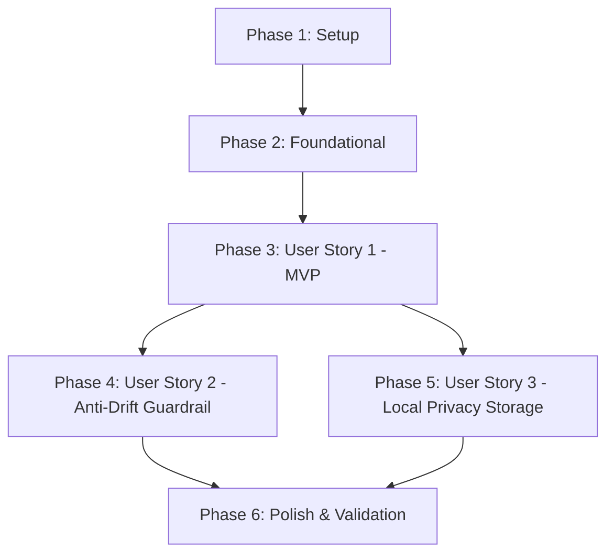

# Tasks: In-Place Popup Expression Assistant

**Feature**: `001-in-place-popup-assistant`  
**Status**: Ready for Implementation  
**Input**: Design artifacts from `specs/001-in-place-popup-assistant/` (`spec.md`, `plan.md`, `data-model.md`, `contracts/`, `research.md`, `quickstart.md`)

---

## Phase 1: Setup (Shared Infrastructure)

**Purpose**: Project initialization and basic workspace structure.

- [X] T001 Create project directories (`src/writing_companion/{core,providers,storage}`, `extension/`, `tests/{unit,integration}`) per implementation plan
- [X] T002 Initialize Python packaging configuration in pyproject.toml with dependencies (`httpx`, `pytest`, `pydantic`) and CLI entry point
- [X] T003 [P] Create GNOME Shell extension manifest in extension/metadata.json with UUID `writing-assistant@sajjadele.github.com` and GNOME 46 shell version compatibility
- [X] T004 [P] Configure development environment and code hygiene settings in pyproject.toml and .gitignore

---

## Phase 2: Foundational (Blocking Prerequisites)

**Purpose**: Core infrastructure and data access layer that MUST be complete before ANY user story can be implemented.

**⚠️ CRITICAL**: No user story implementation can begin until this phase is fully complete.

- [X] T005 Implement configuration loader in src/writing_companion/config.py for API keys (`GROQ_API_KEY`, `GEMINI_API_KEY`), provider preference (`auto`, `groq`, `gemini`, `ollama`, `mock`), DB path `~/.local/share/writing_companion/history.db`, and 4500ms timeout
- [X] T006 [P] Implement core schemas and validation models in src/writing_companion/core/schema.py matching contracts/single-inference-json.json (`is_correct: bool`, `interpreted_meaning_fa: str`, `corrected_text: str`, `changes: list[ChangeItem]`)
- [X] T007 [P] Implement SQLite database connection manager and table initialization in src/writing_companion/storage/sqlite_store.py executing contracts/sqlite-schema.sql with `PRAGMA journal_mode=WAL`
- [X] T008 [P] Implement abstract provider base class in src/writing_companion/providers/base.py defining `async def generate_correction(text: str) -> CorrectionResponse`
- [X] T009 [P] Implement offline mock provider in src/writing_companion/providers/mock_provider.py returning deterministic fixture responses for testing
- [X] T010 Implement core orchestrator engine in src/writing_companion/core/engine.py to coordinate provider dispatch, schema validation, latency calculation, and event persistence
- [X] T011 Implement IPC CLI handler in src/writing_companion/cli.py reading JSON requests from stdin and outputting structured JSON responses to stdout matching contracts/ipc-protocol.md

**Checkpoint**: Foundation ready — backend service, IPC CLI, and schemas are operational. User story implementations can proceed.

---

## Phase 3: User Story 1 - Contextual In-Place Popup & Natural Expression (Priority: P1) 🎯 MVP

**Goal**: Deliver the core user loop: highlight text anywhere on the desktop, press the global shortcut (`Ctrl + Alt + G`), see an in-place popup anchored beside the cursor without Pop-Shell tiling disruption, and auto-paste the suggestion via `Enter`.

**Independent Test**: Highlight draft text in an editor, press `Ctrl + Alt + G`, confirm the popup appears at `global.get_pointer()` without shifting desktop windows, and press `Enter` to auto-paste the replacement via `Shift + Insert`.

### Implementation for User Story 1

- [X] T012 [P] [US1] Implement CLI IPC integration tests in tests/integration/test_cli_ipc.py validating `correct` and `log_feedback` actions with mock provider
- [X] T013 [P] [US1] Implement GNOME Shell extension stylesheet in extension/stylesheet.css with compact dark card layout, rounded corners, subtle drop-shadows, and typographic hierarchy
- [X] T014 [US1] Implement virtual keyboard controller in extension/keyboard.js using `Clutter.InputDeviceType.KEYBOARD_DEVICE` to emit `Shift + Insert` for in-place text replacement
- [X] T015 [US1] Implement in-compositor popup card actor in extension/popup.js using `St.Widget` anchored to `global.get_pointer()` with loading spinner and English text container
- [X] T016 [US1] Implement empty selection detection in extension/popup.js displaying a transient notification toast ("Please select text first") and exiting immediately when selection is empty
- [X] T017 [US1] Implement extension lifecycle, shortcut binding (`Ctrl + Alt + G`), primary selection capture, and non-blocking IPC dispatch via `Gio.Subprocess` in extension/extension.js
- [X] T018 [US1] Implement Groq cloud provider in src/writing_companion/providers/groq_provider.py using Llama 3.3 70B for sub-300ms inference
- [X] T019 [US1] Implement Gemini Flash cloud provider in src/writing_companion/providers/gemini_provider.py for high-speed fallback
- [X] T020 [US1] Implement Enter key binding in extension/popup.js to update clipboards, trigger auto-paste via extension/keyboard.js, dispatch `log_feedback` IPC request, and cleanly dismiss the card

**Checkpoint**: User Story 1 (MVP) is fully functional and testable end-to-end in the GNOME desktop session.

---

## Phase 4: User Story 2 - Semantic Anti-Drift Guardrail & Technical Integrity (Priority: P2)

**Goal**: Protect technical users from semantic drift and broken code by displaying a clear Persian intent checkpoint (`interpreted_meaning_fa`), preserving technical symbols/code identifiers untouched, translating hybrid bracketed words `[واژه]`, and showing a "No Change Needed" state for correct inputs.

**Independent Test**: Draft hybrid sentences (e.g., `Can we [سازگار کنیم] this function?`) and broken technical phrases; verify code identifiers remain intact, Persian meaning is displayed, and grammatically sound inputs show a green checkmark without cosmetic revisions.

### Implementation for User Story 2

- [X] T021 [P] [US2] Implement unit tests in tests/unit/test_prompt.py verifying Minimal Intervention rules, code preservation, and bracket bridge word extraction
- [X] T022 [P] [US2] Implement contract validation tests in tests/unit/test_schema.py validating `is_correct: true` responses and `ChangeItem` categories
- [X] T023 [US2] Implement single-inference prompt templates in src/writing_companion/core/prompt.py with strict rules for code freezing, Persian semantic interpretation, and bracket placeholder resolution
- [X] T024 [US2] Integrate prompt templates into src/writing_companion/core/engine.py ensuring provider output matches single-inference contract before emission
- [X] T025 [US2] Implement Persian semantic checkpoint label (`💡 منظور: ...`) with RTL text layout and custom typography in extension/popup.js
- [X] T026 [US2] Implement "No Change Needed" green confirmation card state in extension/popup.js when `data.is_correct` is true, omitting cosmetic replacements

**Checkpoint**: User Story 2 anti-drift guardrail is operational; code terms are protected and Persian semantic intent is verified.

---

## Phase 5: User Story 3 - Local Privacy & Learning History (Priority: P3)

**Goal**: Silently record every interaction cycle (original text, Persian checkpoint, proposed correction, duration, and user acceptance boolean) strictly into local SQLite storage with zero remote telemetry.

**Independent Test**: Trigger multiple queries, accept some with `Enter` and cancel others with `Esc`; query `~/.local/share/writing_companion/history.db` to confirm rows with `accepted = 1` and `accepted = 0` are persisted with complete metadata.

### Implementation for User Story 3

- [X] T027 [P] [US3] Implement storage unit tests in tests/unit/test_storage.py verifying SQLite insertion, WAL mode pragmas, indexing, and acceptance status updates
- [X] T028 [US3] Implement event insertion method `record_event()` in src/writing_companion/storage/sqlite_store.py persisting `CorrectionEvent` with timestamp and duration
- [X] T029 [US3] Implement feedback update method `update_acceptance()` in src/writing_companion/storage/sqlite_store.py setting `accepted = 1` on Enter or `accepted = 0` on dismissal
- [X] T030 [US3] Hook `log_feedback` action in src/writing_companion/cli.py and src/writing_companion/core/engine.py to update SQLite records via event ID
- [X] T031 [US3] Implement Esc key and outside-click dismissal handler in extension/popup.js dispatching `accepted: false` via IPC before closing the actor

**Checkpoint**: All interactions are persisted locally with zero external network telemetry; learning profile data is accumulating.

---

## Phase 6: Polish & Cross-Cutting Concerns

**Purpose**: System resilience, UI polish, edge cases, and end-to-end quickstart validation.

- [X] T032 [P] Implement smooth internal scrolling (`St.ScrollView`) in extension/popup.js for long text selections exceeding 800 characters
- [X] T033 [P] Implement 4500ms subprocess timeout watchdog and error state card in extension/extension.js per contracts/ipc-protocol.md
- [X] T034 [P] Implement local Ollama fallback provider in src/writing_companion/providers/ollama_provider.py for offline resilience
- [X] T035 Execute full manual validation checklist per specs/001-in-place-popup-assistant/quickstart.md across terminal, text editor, and web browser

---

## Dependencies & Execution Order

### Phase Dependencies

- **Setup (Phase 1)**: No dependencies — can start immediately.
- **Foundational (Phase 2)**: Depends on Phase 1 — **BLOCKS** all user story implementations.
- **User Story 1 (Phase 3 - MVP)**: Depends on Phase 2 — unlocks core in-place interaction.
- **User Story 2 (Phase 4)**: Depends on Phase 2 and Phase 3 popup actor — enhances prompt and UI with Persian checkpoint.
- **User Story 3 (Phase 5)**: Depends on Phase 2 and Phase 3 IPC loop — adds persistent local logging.
- **Polish (Phase 6)**: Depends on completion of User Stories 1, 2, and 3.

### Parallel Opportunities

- In Phase 1: `T003` and `T004` can run in parallel with `T001` and `T002`.
- In Phase 2: `T006` (schemas), `T007` (storage), `T008` (base provider), and `T009` (mock provider) can all be built in parallel.
- In Phase 3: `T012` (tests) and `T013` (CSS) can run in parallel before frontend/backend integration.
- In Phase 4: `T021` (prompt tests) and `T022` (schema tests) can run in parallel.
- In Phase 5: `T027` (storage tests) can run in parallel with UI feedback hooks.
- In Phase 6: `T032` (scrolling), `T033` (watchdog), and `T034` (Ollama) can run in parallel.

---

## Implementation Strategy

### MVP Scope (User Story 1)
The fastest path to a usable, testable desktop prototype:
1. Complete **Phase 1** (Setup) and **Phase 2** (Foundational).
2. Complete **Phase 3** (User Story 1) with Mock / Groq provider.
3. **Verify MVP**: Select text in VS Code, press `Ctrl + Alt + G`, see in-place popup, press `Enter` to auto-paste.
4. **Deploy / Test Incrementally**: Layer on User Story 2 (Persian Semantic Checkpoint) and User Story 3 (SQLite Local Logging).
